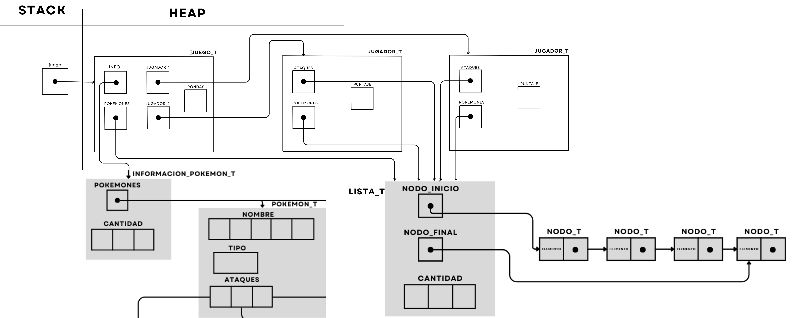

<div align="right">

</div>

# TP2

## Repositorio de Nicolas Cardone - 111148 - nicolascardone02@gmail.com

- Para compilar:

```bash
gcc main.c -o main
```

- Para ejecutar:

```bash
./hash
```

- Para ejecutar con valgrind:
```bash
make valgrind-chanutron
```
---
##  Funcionamiento

El funcionamiento del tp es el siguiente, desde el main apenas ejecutamos nos pide el nombre del archivo a leer para extraer sus pokemones con sus respectivos ataques. Ya sea habiendo un error leyendo el archivo o que tengo menos de 6 pokemones que es la cantidad mínima. Se corta la ejecucion del programa liberando la memoria correctamente. Listamos todos los pokemones, creamos el adversario y mostramos los pokemones disponibles para jugar. Le pedimos al usuario que seleccione sus 3 pokemones, en caso de que haya alguno repetido o que no este en el listado, se imprime el error y se le vuelve a pedir que ingrese los 3 pokemones. Por último está el bucle de las rondas que se le pide al jugador un pokemon y un ataque, en caso de que el ataque este repetido o sea incorrecto se imprime el error y se vuelve a pedir que ingrese el pokemon y el ataque. Al final de cada ronda se muestra el ataque y pokemon de ambos jugadores, y el puntaje parcial. Finalizado el juego se imprime el ganador y el respectivo puntaje.

### Diagrama de Memoria:

<div align="center">

</div>


---

## Respuestas a las preguntas teóricas
1) Para la estrcutura juego tengo la informacion_pokemon_t del primer trabajo ya que cuando leo el archivo se guarda todo en esa estructura, después una lista de pokemones que justamente es guardado en el TDA lista como el enunciado pedia listar pokemones me parecia la manera mas correcta ya que despues para recorrer todo lo que tenemos guardado se me hace más fácil con una lista. Luego una estrcutura llamada jugador que representa a cada jugador del juego, con sus 3 pokemones a jugar, sus 9 ataques posibles y su respectivo puntaje, también decidi que sean listas más que nada para la hora de recorrer y además para eliminar un elemento de la posición que es una lógica que utilizo para borrar los ataques que ya usó el jugador. Por último en el juego tengo rondas que como jugamos con 3 pokemones debe ser menor a 9, ya que cuando llega a 9 significa que el juego finalizó. 
Para el adversario también tengo los pokemones totales del juego en una lista como se explicó anteriormente, los 3 pokemones del adversario para jugar en una lista llamada pokemones_adversario, por la facilidad de recorrer completamente los elementos. Por último tengo rondas y ataque que son dos enteros, estos lo utilzo para elegir la proxima jugada del adversario, lo que implementé en esa funcion rondas representa el numero del pokemon en la lista pokemones_adversario, el cual puede ir de 0 a 2 y el ataque es la posición del ataque a utilizar, cada vez que se llama a la función ataque va a incrementar hasta llegar a 3 lo que significa que ya se utilizaron todos los ataques de un pokemon, lo que implica que ronda aumenta recien ahi y ataque vuelve a 0, cambiando al siguiente pokemon de la lista. Esto fue lo que hice para la eleccion de la jugada del adversario sea correcta.

2) Adversario:
- adversario_crear(): tiene una complejidad O(1) ya que lo unico que hace es pedir memoria.

-adversario_proxima_jugadar(): lista_crear es una operacion constante O(1), lista_elemento_en_posicion es acceder a una posicion de la lista es O(n) ya que debemos iterar hasta llegar a esa posicion, pero en este caso lo podemos tomar como constante ya que maximo es O(3),con_cada_ataque se ejecuta tres veces, y cada llamada a funcion y lista_insertar es constante O(1), la complejidad total de esta sección sería O(3) o simplemente O(1), ya que es un número constante de operaciones, en conclusion si todas las operaciones mencionadas son de complejidad constante, la complejidad total de la función sería O(1).

-adversario_pokemon_seleccionado(): acá tenemos el lista_buscar_elemento que es O(n) ya que no sabemos cuantos pokemones podemos tener para seleccionar en total, lo que implica que se recorrerá n veces,y en le lista_insertar lo podemos tomar constante ya que la lista de pokemones adversario como maximo tendrá 3 pokemones, lo que lleva a una complejidad O(n).

-adversario_seleccionar_pokemon(): en esta funcion tenemos lista_con_cada_elemento que es O(n) ya que no sabemos cuantos pokemones podemos tener para seleccionar en total, lo que implica que se recorrerá n veces, luego en lista_aux insertamos todos los elementos de adversario->pokemones ya que esta ultima no se podia modificar, acceder a posicion es O(n), pedir memoria,copiar y numero aleratorio son constantes, por último insertar en pokemones_adversario es maximo O(3) por lo que se toma constante, finalmente esta funcion tiene una complejidad O(n).

Juego:
-juego_crear(): tiene una complejidad O(1) ya que lo unico que hace es pedir memoria.

-juego_cargar_pokemon(): en esta funcion dependemos de pokemon_cargar_archivoons de la cantidad de pokemones que tiene el archivo, lo que lleva a la cantidad de linea a procesar, como no es constante es O(n) el resto de funciones que se utilizan como pedir memoria o asignar es todo constante, por lo que la complejidad total de la funcion es O(n) donde n es el  es el número total de caracteres en el archivo.

-juego_listar_pokemon(): aca el lista_crar es constante ya que solo se pide memoria, pero luego el con_Cada_pokemon es O(n) ya que no sabemos la cantidad total de pokemones del archivo, que cada uno se inserta al final de la lista pero esta es O(1), en conclusion esta funcion es O(n).

-juego_seleccionar_pokemon(): acá tenemos pokemon_buscar que tiene O(n) que es la cantidad de pokemones en total que hay guardados, ya que debemos recorrer todos hasta encontrar el que queramos, luego el resto de funciones son constantes, cada_ataque es O(3) porque sabemos que tenemos siempre 3 ataques. Pero el strcmp depende de la cantidad de carcateres de las cadenas a comparar lo que lleva a una complejidad O(m) donde m es la cantidad de caracteres. En conclusion la complejidad de esta funcion es O(m*n).

-juego_jugar_turno(): como aclaramos anteriormente lista_buscar_elemento es O(n),pokemon_buscar_ataque es maximo O(3) ya que sabemos que tiene 3 ataques como máximo lo que lleva a complejidad constante. En ataque_utilizado recorremos la lista ataques del jugador que sabemos que como maximo tiene 9 elementos que son todos los ataques disponibles lo que lleva a complejidad constante, luego el calcular_resultado_jugada es O(1) ya que se mete a un caso del swtich y calcula el resultado correcto. Finalmente la complejidad es O(n)

-juego_obtener_puntaje(): es O(1) ya que solo accedemos al dato que queramos segun cual sea el jugador recibido por parámetro.

-juego_finalizado(): es O(1) ya que solo comparamos en un if si se llegó a un numero de rondas.


